# isb2-kings-layer 👑

## 📚 Panduan Tugas Kelompok Week 2: Gallery Card Kolaboratif

Proyek ini adalah wadah kolaborasi untuk tim **King Slayer** dalam menyusun antarmuka web interaktif menggunakan **Semantic HTML**, **CSS Grid & Flexbox**, dan **Tailwind CSS**, serta menerapkan alur kerja profesional dengan **Git & GitHub**.

---

## ⚠️ Aturan Utama (Golden Rules)

> 🚫 **DILARANG KERAS MELAKUKAN COMMIT DAN PUSH LANGSUNG KE BRANCH `main`!**  
> Seluruh pengerjaan fitur wajib dilakukan pada branch masing-masing dan digabungkan melalui **Pull Request (PR)**.
>
> 🔒 **KERJAKAN HANYA PADA SLOT MASING-MASING!**  
> Jangan mengedit atau menghapus kode/komentar milik anggota lain di [`index.html`](file:///Users/vendot/Apps/Informatics%20Summit%20Bootcamp%202/isb2-kings-layer/index.html) untuk menghindari konflik kode (*merge conflict*).

---

## 🛠️ Step-by-Step Alur Kerja Git (Git Workflow Best Practices)

Berikut adalah panduan langkah demi langkah dari awal persiapan repositori hingga proses penggabungan (*merge*) kode ke branch `main`.

```mermaid
graph LR
    A[Clone Repo] --> B[Sync Main]
    B --> C[Create Branch]
    C --> D[Code in Slot]
    D --> E[Atomic Commits x3]
    E --> F[Sync with Main]
    F --> G[Push Branch]
    G --> H[Open Pull Request]
    H --> I[Review & Approval]
    I --> J[Merge to Main]
    J --> K[Pull Latest Main Locally]
```



---

### 1️⃣ Persiapan Awal (Clone & Setup)

1. Buka terminal (Git Bash, Command Prompt, atau Terminal di VS Code).
2. Clone repositori ke komputer lokal Anda:
   ```bash
   git clone https://github.com/King-Slayer-ISB-2/isb2-kings-layer.git
   cd isb2-kings-layer
   ```
3. Pastikan Anda berada di branch `main` yang terupdate:
   ```bash
   git checkout main
   git pull origin main
   ```

---

### 2️⃣ Membuat & Berpindah ke Feature Branch

Buat branch baru dengan penamaan standar: `feature/card-[namaKamu]` (gunakan huruf kecil tanpa spasi).

```bash
# Membuat dan langsung berpindah ke branch baru
git checkout -b feature/card-khalysa

# Cek branch yang sedang aktif (pastikan ada tanda * di branch baru Anda)
git branch
```

---

### 3️⃣ Pengerjaan Kode & Slot Khusus

1. Buka file [`index.html`](file:///Users/vendot/Apps/Informatics%20Summit%20Bootcamp%202/isb2-kings-layer/index.html).
2. Cari komentar penanda nama Anda, misalnya:
   ```html
   <!-- ===== CARD 1 - Khalysa Dyanti Damara ===== -->
   <!-- Silakan membuat elemen <article> atau <div> untuk card di bawah komentar ini -->
   ```
3. Tulis struktur card menggunakan elemen Semantic HTML (misalnya `<article>`) dan styling Tailwind CSS sesuai tema kelompok.

---

### 4️⃣ Praktik Commit Bertahap (*Atomic Commits* & *Conventional Commits*)

Setiap peserta diwajibkan melakukan **minimal 3 kali commit** selama proses pembuatan komponen. Lakukan commit secara bertahap (atomic commit) sesuai kemajuan kerja.

#### Format Pesan Commit:
Gunakan standar *Conventional Commits*:
- `feat:` untuk penambahan fitur/struktur baru (HTML/konten).
- `style:` untuk perubahan styling, warna, layout, font, atau Tailwind classes.
- `fix:` untuk memperbaiki bug, tautan rusak, atau layout glitch.
- `docs:` untuk perubahan pada dokumentasi.

#### Contoh 3 Alur Commit Bertahap:

##### 🟢 Commit 1: Membuat struktur dasar HTML Card
```bash
# 1. Cek file yang berubah
git status

# 2. Tambahkan perubahan ke staging area
git add index.html

# 3. Commit dengan pesan deskriptif
git commit -m "feat: add semantic structure and card content for Khalysa"
```

##### 🟢 Commit 2: Menambahkan styling Tailwind & Responsivitas
```bash
git add index.html
git commit -m "style: apply tailwind layout, colors, and badge styling"
```

##### 🟢 Commit 3: Menambahkan efek interaksi (hover, transisi) & polish
```bash
git add index.html
git commit -m "style: add hover micro-interactions and optimize image display"
```

---

### 5️⃣ Sinkronisasi dengan `main` Sebelum Push (*Best Practice*)

Sebelum mengirimkan kode ke GitHub, pastikan branch Anda sudah sinkron dengan perubahan terbaru dari `main` (antisipasi bila ada rekan yang baru saja merge):

```bash
# Ambil pembaruan terbaru dari remote tanpa pindah branch
git fetch origin

# Gabungkan perubahan main ke branch fitur Anda jika ada
git merge origin/main
```
*(Jika tidak ada konflik atau semua up-to-date, Anda bisa lanjut ke langkah push).*

---

### 6️⃣ Push Branch ke Remote Repository (GitHub)

Kirim branch Anda ke GitHub:

```bash
git push -u origin feature/card-[namaKamu]
```
> **Contoh:**
> ```bash
> git push -u origin feature/card-khalysa
> ```

---

### 7️⃣ Membuat Pull Request (PR) di GitHub

1. Buka repositori tim di GitHub: `https://github.com/King-Slayer-ISB-2/isb2-kings-layer`.
2. Anda akan melihat banner kuning bertuliskan **"Compare & pull request"**. Klik tombol tersebut.
3. Pastikan konfigurasi branch:
   - **base repository**: `King-Slayer-ISB-2/isb2-kings-layer` | **base**: `main`
   - **head repository**: `...` | **compare**: `feature/card-[namaKamu]`
4. **Judul PR**: Gunakan format yang rapi:
   > `feat: add [Nama Anggota] travel card component`
5. **Deskripsi PR**: Jelaskan apa saja yang dibuat dengan format checklist berikut:
   ```markdown
   ### Deskripsi Perubahan
   - Menambahkan komponen card destinasi wisata untuk [Nama Anggota]
   - Menggunakan elemen semantic `<article>`
   - Menerapkan styling Tailwind CSS (shadow, rounded, hover animation)

   ### Checklist
   - [x] Kode ditulis hanya di slot yang ditentukan
   - [x] Minimal 3 commit telah dipenuhi
   - [x] Tampilan responsif (mobile & desktop)
   - [ ] Siap direview oleh Mentor / Rekan Tim
   ```
6. Tambahkan **Mentor** atau rekan tim di kolom **Reviewers** di sebelah kanan.
7. Klik tombol **Create Pull Request**.

---

### 8️⃣ Menangani Review & Revisi (Jika Ada Masukan)

Jika Mentor atau rekan tim meminta revisi saat review:
1. Kembali ke komputer lokal Anda pada branch fitur yang sama (`feature/card-[namaKamu]`).
2. Lakukan perbaikan pada kode.
3. Lakukan commit dan push kembali:
   ```bash
   git add index.html
   git commit -m "fix: adjust card contrast and image aspect ratio"
   git push origin feature/card-[namaKamu]
   ```
4. PR di GitHub akan otomatis terupdate dengan commit terbaru.

---

### 9️⃣ Merge Pull Request (Khusus Mentor / Atas Persetujuan)

1. Setelah semua cek hijau (tidak ada konflik) dan PR mendapat **Approve**:
2. Klik tombol **Merge pull request** (disarankan memilih **Squash and merge** atau **Rebase and merge** sesuai arahan mentor).
3. Konfirmasi merge dengan klik **Confirm merge**.
4. Klik **Delete branch** di GitHub untuk merapikan repositori.

---

### 🔟 Bersih-bersih Lokal Setelah Merge (*Post-Merge Cleanup*)

Setelah PR Anda berhasil di-merge ke `main`, lakukan langkah ini di komputer lokal Anda:

```bash
# 1. Pindah kembali ke branch main
git checkout main

# 2. Tarik kode terbaru yang sudah digabungkan dari GitHub
git pull origin main

# 3. Hapus branch fitur lokal yang sudah selesai
git branch -d feature/card-[namaKamu]
```

---

## 👥 Daftar Anggota Tim & Slot Pengerjaan

| Slot | Nama Anggota | Branch Name | Status |
| :--- | :--- | :--- | :--- |
| **Card 1** | Khalysa Dyanti Damara | `feature/card-khalysa` | ⏳ Pending |
| **Card 2** | Zhalikhah Khairunnisa | `feature/card-zhalikhah` | ⏳ Pending |
| **Card 3** | Khairil Abdillah | `feature/card-khairil` | ⏳ Pending |
| **Card 4** | Gustian Indeka Yulianto | `feature/card-gustian` | ⏳ Pending |
| **Card 5** | Pasha Fadillah | `feature/card-pasha` | ⏳ Pending |
| **Card 6** | Muhammad Iqbal Yahya | `feature/card-iqbal` | ⏳ Pending |

---
*Happy Coding & Happy Collaborating! 🚀*